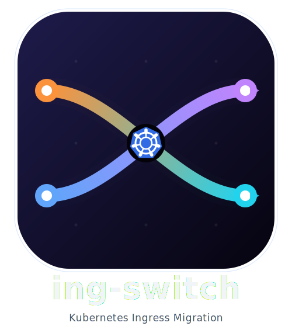

<p align="center">
  
</p>

# ing-switch

**Migrate from Ingress NGINX to Traefik or Gateway API — in minutes, not days.**

Ingress NGINX is being retired in March 2026. `ing-switch` scans your cluster, maps every annotation, generates migration manifests, and walks you through the cutover — with a visual UI or pure CLI.

---

## What it does

```
ing-switch scan      # detect your controller + list all ingresses
ing-switch analyze   # map every annotation to the target controller
ing-switch migrate   # generate ready-to-apply manifests
ing-switch ui        # open the visual migration dashboard at :8080
```

| Step | What you get |
|------|-------------|
| **Scan** | Ingress controller version, all ingresses across namespaces, annotation count |
| **Analyze** | Per-ingress annotation compatibility table: ✅ supported / ⚠️ partial / ❌ unsupported |
| **Migrate** | Complete output directory — Middlewares, HTTPRoutes, Gateway, policies, verify script, DNS guide, cleanup scripts |
| **UI** | 4-page dashboard: Detect → Analyze → Migrate → Validate |

---

## Supported targets

| Target | What's generated |
|--------|-----------------|
| **Traefik** | Traefik Middleware CRDs + updated Ingress resources (stays on `kind: Ingress`) |
| **Gateway API** (Envoy Gateway) | GatewayClass + Gateway + HTTPRoutes + BackendTrafficPolicy + SecurityPolicy |

---

## Annotation coverage

Over 50 `nginx.ingress.kubernetes.io/*` annotations are mapped for both targets:

- SSL/TLS redirect, HSTS
- CORS (all 6 fields)
- Rate limiting, connection limits, IP allowlist/denylist
- External authentication (`auth-url`, `auth-response-headers`)
- Session affinity (sticky cookies)
- Canary deployments (weight, header, cookie)
- Path rewrite + regex routing
- Timeouts (`proxy-read-timeout`, `proxy-connect-timeout`)
- WebSocket, gRPC passthrough
- Custom headers, response header modification

---

## Installation

### Download binary (recommended)

```bash
# macOS arm64
curl -L https://github.com/saiyam1814/ing-switch/releases/latest/download/ing-switch-darwin-arm64 -o ing-switch
chmod +x ing-switch
sudo mv ing-switch /usr/local/bin/

# macOS amd64
curl -L https://github.com/saiyam1814/ing-switch/releases/latest/download/ing-switch-darwin-amd64 -o ing-switch
chmod +x ing-switch && sudo mv ing-switch /usr/local/bin/

# Linux amd64
curl -L https://github.com/saiyam1814/ing-switch/releases/latest/download/ing-switch-linux-amd64 -o ing-switch
chmod +x ing-switch && sudo mv ing-switch /usr/local/bin/
```

### Build from source

```bash
git clone https://github.com/saiyam1814/ing-switch.git
cd ing-switch
make build        # builds UI then Go binary
./ing-switch --help
```

Requirements: Go 1.22+, Node.js 20.19+ (for UI build only)

---

## Quick start

```bash
# Point at your cluster
export KUBECONFIG=~/.kube/config

# 1. Scan — see what you have
ing-switch scan

# 2. Analyze — understand compatibility
ing-switch analyze --target gateway-api

# 3. Migrate — generate all manifests
ing-switch migrate --target gateway-api --output-dir ./migration

# 4. Review then apply
kubectl apply -f ./migration/03-gateway/
kubectl apply -f ./migration/04-httproutes/

# 5. Open the visual UI (optional)
ing-switch ui
```

### Traefik migration

```bash
ing-switch migrate --target traefik --output-dir ./migration

# Apply middlewares first, then updated ingresses
kubectl apply -f ./migration/02-middlewares/
kubectl apply -f ./migration/03-ingresses/
```

---

## Generated output structure

### Gateway API migration

```
migration/
├── 00-migration-report.md          # Full annotation analysis + compatibility summary
├── 01-install-gateway-api-crds/    # install.sh for Gateway API CRDs
├── 02-install-envoy-gateway/       # Helm install script + values.yaml
├── 03-gateway/
│   ├── gatewayclass.yaml           # GatewayClass (Envoy Gateway)
│   └── gateway.yaml                # Gateway with HTTP + HTTPS listeners
├── 04-httproutes/                  # One HTTPRoute per ingress
│   ├── <ns>-<name>-redirect.yaml   # HTTP→HTTPS redirect route (sectionName: http)
│   └── <ns>-<name>.yaml            # Backend route (sectionName: https-N)
├── 05-policies/                    # BackendTrafficPolicy, SecurityPolicy (Envoy ext)
├── 06-verify.sh                    # Test script per hostname
└── 07-cleanup/
    └── remove-nginx.sh             # Remove NGINX after cutover
```

### Traefik migration

```
migration/
├── 00-migration-report.md
├── 01-install-traefik/             # Helm install script + values.yaml
├── 02-middlewares/                 # Traefik Middleware CRDs (one file per ingress)
├── 03-ingresses/                   # Updated Ingress resources (traefik ingressClassName)
├── 04-verify.sh
├── 05-dns-migration.md
└── 06-cleanup/
    ├── 01-preserve-ingressclass.yaml
    └── 02-remove-nginx.sh
```

---

## CLI reference

```
Flags (global):
  --kubeconfig string   Path to kubeconfig (default: ~/.kube/config)
  --context string      kubeconfig context to use
  --namespace string    Limit to one namespace (default: all)

ing-switch scan
  --output table|json   Output format (default: table)

ing-switch analyze
  --target string       traefik | gateway-api  (required)
  --output table|json

ing-switch migrate
  --target string       traefik | gateway-api  (required)
  --output-dir string   Output directory (default: ./migration)

ing-switch ui
  --port int            Port for the web UI (default: 8080)
```

---

## Examples

The `examples/` directory contains 11 production-realistic NGINX Ingress configurations covering every major annotation category:

| File | Covers |
|------|--------|
| `01-basic-routing.yaml` | Path routing, TLS termination |
| `02-ssl-tls.yaml` | SSL redirect, HSTS, force-ssl |
| `03-auth-external.yaml` | External auth (auth-url, auth-response-headers) |
| `04-session-affinity.yaml` | Sticky cookies (all 8 session-cookie-* fields) |
| `05-canary.yaml` | Canary by weight, header, cookie |
| `06-cors.yaml` | Full CORS (all 6 cors-* annotations) |
| `07-path-rewrite-regex.yaml` | Regex routing, rewrite-target capture groups |
| `08-rate-limit-ip.yaml` | Rate limiting, IP allowlist/denylist |
| `09-websocket.yaml` | WebSocket upgrade |
| `10-grpc.yaml` | gRPC passthrough |
| `11-full-featured.yaml` | All of the above combined |

```bash
# Migrate all examples
kubectl apply -f examples/
ing-switch migrate --target gateway-api --output-dir ./migration-examples
```

---

## How it handles complex cases

### HTTP→HTTPS redirect

The tool generates **two separate HTTPRoutes** per ingress (not two rules in one route, which causes redirect loops):

```yaml
# <name>-redirect (attached to HTTP listener only via sectionName: http)
# → returns 301/302 for all HTTP requests

# <name> (attached to HTTPS listener via sectionName: https-N)
# → routes HTTPS requests to backends
```

### Regex paths

Paths with regex characters (`(`, `)`, `|`, `[`, `]`) are automatically detected and converted to `PathPrefix` → `RegularExpression` type, even when the `use-regex` annotation is absent.

### Timeout mapping

`proxy-read-timeout` → `backendRequest` only. `proxy-connect-timeout` is intentionally omitted to avoid the Gateway API constraint `backendRequest ≤ request` being violated by typical nginx configs (read=300s, connect=5s).

---

## Architecture

```
ing-switch/
├── cmd/                    # Cobra CLI commands (scan, analyze, migrate, ui)
├── pkg/
│   ├── scanner/            # cluster.go, ingress.go, controller.go
│   ├── analyzer/           # annotations.go, compatibility.go (~50 annotation mappings)
│   ├── migrator/
│   │   ├── traefik/        # middleware.go, mappings.go
│   │   └── gatewayapi/     # httproute.go, gateway.go, migrator.go
│   ├── generator/          # output.go, report.go, ZIP generation
│   └── server/             # HTTP server, REST API, embedded React UI
└── web/                    # React 18 + TypeScript + Tailwind CSS + Vite
    └── src/
        ├── pages/          # Detect, Analyze, Migrate, Validate
        └── components/     # IngressTable, AnnotationMatrix, MigrationGaps, FileViewer
```

---

## Why this exists

**March 2026**: Ingress NGINX is being deprecated. ~50% of Kubernetes clusters depend on it.

Existing tools (`ingress2gateway`) handle basic routing but miss annotation coverage and have no guidance for the 30–40% of annotations that are "partial" — they generate valid YAML but don't tell you what you lose or how to compensate.

`ing-switch` was built to cover the full migration lifecycle: scan → analyze → generate → verify → cutover → cleanup.

---

## Contributing

Issues and PRs welcome. The annotation mapping database lives in:
- `pkg/analyzer/compatibility.go` — status + target resource per annotation
- `pkg/server/guides.go` — human-readable what/fix/example per annotation

---

## License

MIT
