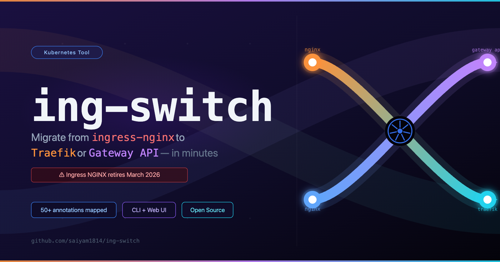
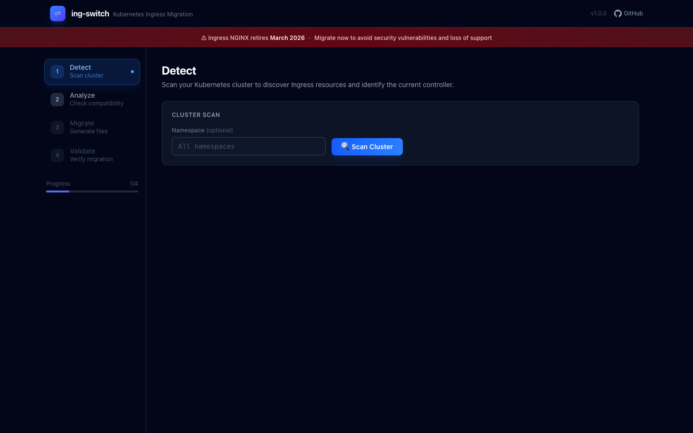
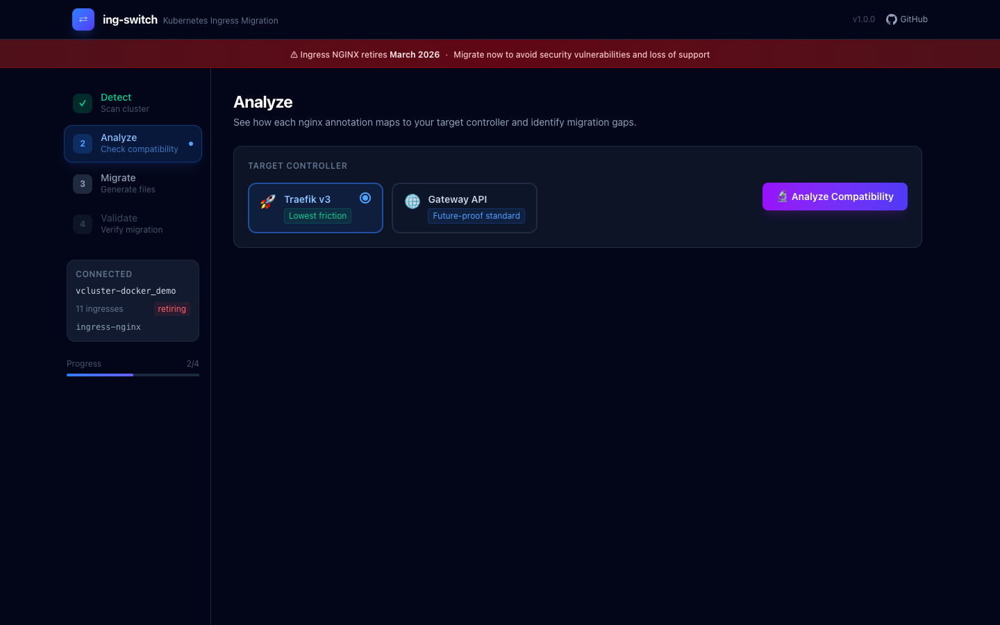
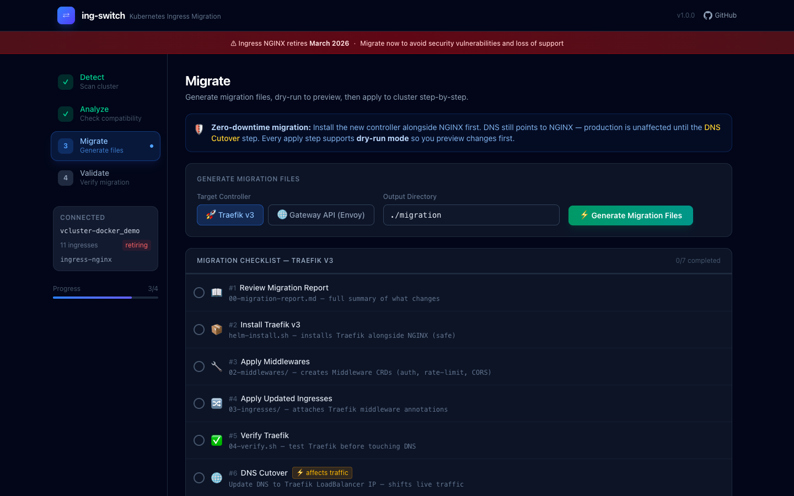
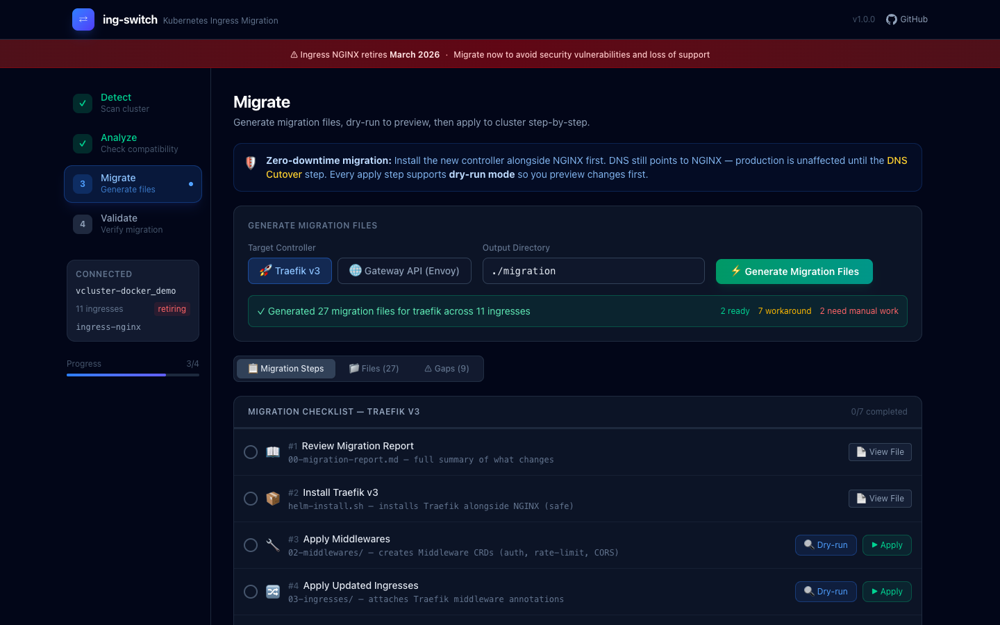
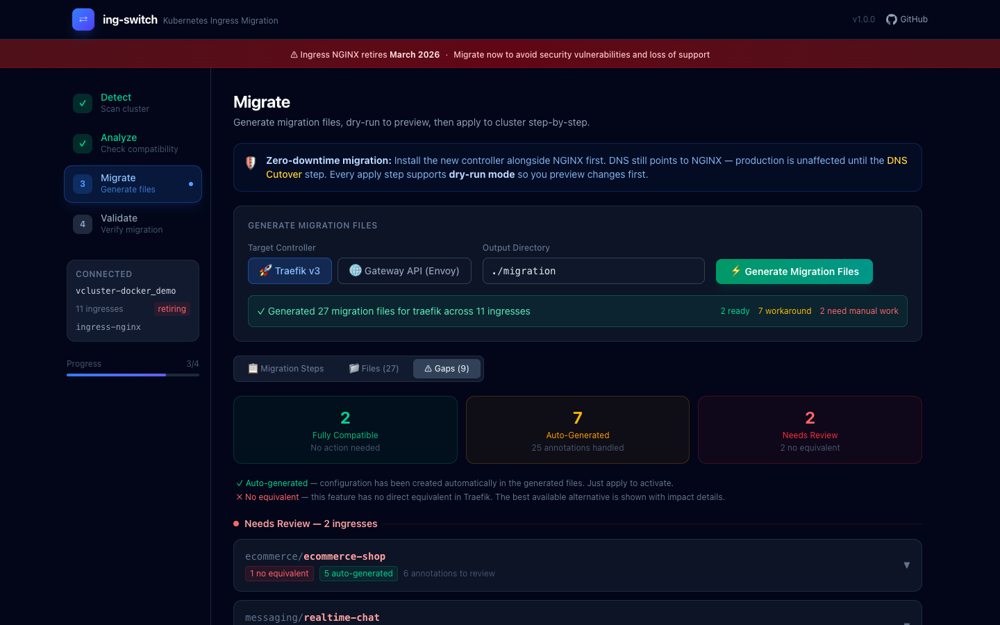
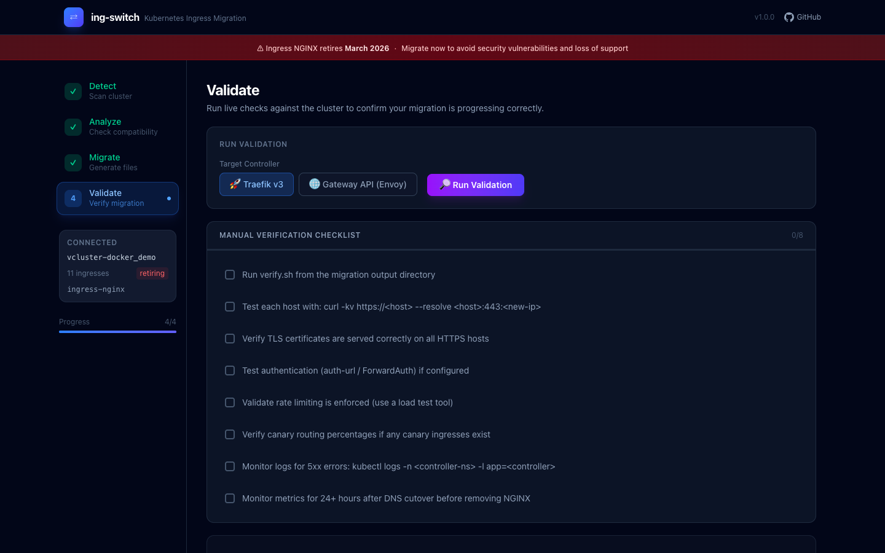

# ing-switch: Migrate from Ingress NGINX to Traefik or Gateway API — in Minutes, Not Days

If you run Kubernetes, there's a deadline you can't ignore: **Ingress NGINX is being deprecated in March 2026**. Roughly half of all Kubernetes clusters depend on it. That's a lot of teams who need a migration plan — and most of them are going to discover that it's harder than it looks.

The core problem isn't moving from one controller to another. It's that Ingress NGINX is held together by annotations. Hundreds of `nginx.ingress.kubernetes.io/*` annotations that control everything from TLS redirects to rate limiting to sticky sessions to canary deployments. These annotations have no direct equivalent in a new controller. Some map cleanly. Some map partially, with caveats. Some have no equivalent at all. And the existing tooling (`ingress2gateway`) only handles basic routing — it doesn't tell you what you're losing or how to compensate.

That's why I built **[ing-switch](https://github.com/saiyam1814/ing-switch)** — an open-source CLI + visual UI that takes you through the full migration lifecycle: scan → analyze → generate → verify → cutover → cleanup.

---

## What ing-switch does

The tool has four commands that map to four stages of migration:

```bash
ing-switch scan      # detect your controller + list all ingresses
ing-switch analyze   # map every annotation to the target controller
ing-switch migrate   # generate ready-to-apply manifests
ing-switch ui        # open the visual 4-page migration dashboard at :8080
```

And it supports two migration targets:

| Target | What's generated |
|--------|-----------------|
| **Traefik v3** | Traefik Middleware CRDs + updated Ingress resources (stays on `kind: Ingress`, no new CRDs to learn) |
| **Gateway API (Envoy Gateway)** | GatewayClass + Gateway + HTTPRoutes + BackendTrafficPolicy + SecurityPolicy |

**Traefik** is the lowest-friction path: you keep `kind: Ingress`, your team learns almost nothing new, and almost all annotations have a Traefik equivalent. **Gateway API** is the future-proof path: standardized, implementation-agnostic, and where the ecosystem is heading — but it requires more preparation for partial-support annotations.

---

## Annotation coverage: the hard part

This is the part most migration tools skip. `ing-switch` maps over 50 `nginx.ingress.kubernetes.io/*` annotations for both targets. Here's a sample:

| Annotation | Traefik | Gateway API |
|------------|---------|------------|
| `ssl-redirect` | ✅ RedirectScheme Middleware | ✅ HTTPRoute RequestRedirect filter |
| `force-ssl-redirect` | ✅ Permanent redirect | ✅ 301 HTTPRoute redirect |
| `enable-cors` (all 6 fields) | ✅ Headers Middleware | ⚠️ Manual ResponseHeaderModifier (no native CORS filter in v1) |
| `auth-url` (ForwardAuth) | ✅ ForwardAuth Middleware | ⚠️ SecurityPolicy (Envoy ext-auth) |
| `limit-rps` / `limit-rpm` | ✅ RateLimit Middleware | ⚠️ BackendTrafficPolicy (Envoy extension) |
| `whitelist-source-range` | ✅ IPAllowList Middleware | ⚠️ HTTPRouteMatch source IP (limited) |
| `affinity: cookie` (sticky sessions) | ✅ Service sticky annotation | ⚠️ BackendLBPolicy SessionPersistence (v1.1) |
| `canary` + `canary-weight` | ✅ Weighted service split | ✅ HTTPRoute weighted backendRefs |
| `rewrite-target` | ✅ ReplacePath/AddPrefix | ✅ URLRewrite filter |
| `proxy-read-timeout` | ⚠️ ServersTransport CRD | ⚠️ HTTPRoute spec.rules[].timeouts |
| `configuration-snippet` | ❌ Not supported (security) | ❌ Not supported |
| `session-cookie-samesite` | ✅ Sticky cookie | ❌ Not in BackendLBPolicy spec |

The tool shows you exactly which category each annotation falls into: fully supported (just apply the generated YAML), partial (the YAML is generated, but read the note about what's different), or unsupported (manual work required, with guidance on the best alternative).

---

## Installation

```bash
# macOS arm64
curl -L https://github.com/saiyam1814/ing-switch/releases/latest/download/ing-switch-darwin-arm64 -o ing-switch
chmod +x ing-switch && sudo mv ing-switch /usr/local/bin/

# Linux amd64
curl -L https://github.com/saiyam1814/ing-switch/releases/latest/download/ing-switch-linux-amd64 -o ing-switch
chmod +x ing-switch && sudo mv ing-switch /usr/local/bin/
```

Or build from source:
```bash
git clone https://github.com/saiyam1814/ing-switch.git
cd ing-switch
make build   # builds React UI then embeds it in the Go binary
./ing-switch --help
```

---

## The visual UI: a 4-page migration dashboard

The easiest way to understand what `ing-switch` does is to open the UI:

```bash
ing-switch ui   # opens at localhost:8080
```

### Page 1: Detect

The first page scans your cluster and discovers every Ingress resource across all namespaces, identifies the controller type and version, and flags each ingress by complexity.



*The tool shows a countdown banner — Ingress NGINX retires March 2026 — and lets you scope the scan to a specific namespace or scan everything.*

After clicking **Scan Cluster**, the tool connects to your cluster via kubeconfig and enumerates every `networking.k8s.io/v1 Ingress` object. In my test cluster (a vcluster running 11 production-realistic ingresses), the sidebar updated immediately to show "11 ingresses · retiring · ingress-nginx":


*The sidebar shows your cluster name, ingress count, and controller status. "Retiring" badge means the detected controller is Ingress NGINX.*

### Page 2: Analyze

The Analyze page is where you decide your migration target. You pick between **Traefik v3** (labeled "Lowest friction") or **Gateway API via Envoy Gateway** (labeled "Future-proof standard"), then click **Analyze Compatibility**.



The engine runs through every annotation on every ingress and produces a per-ingress compatibility matrix. Each annotation gets a status badge:
- **Green (supported)** — the generated YAML covers this fully; just apply it
- **Yellow (partial)** — the feature works but with limitations; the note explains exactly what's different
- **Red (unsupported)** — no direct equivalent exists; the tool explains the best available workaround

This is the output that replaces weeks of reading changelogs and GitHub issues.

### Page 3: Migrate

The Migrate page generates the complete output directory of Kubernetes manifests. Click **Generate Migration Files** and the tool writes every file needed for a zero-downtime cutover.



*The checklist walks you through every step in order, so you can't accidentally skip a dependency (like applying GatewayClass before HTTPRoutes).*

After generation, each step gains **View File**, **Dry-run**, and **Apply** buttons:



*The tool generated 27 migration files for Traefik across 11 ingresses. Each checklist item links to the file it creates, and you can preview the YAML before applying.*

The **Gaps tab** gives you the executive summary — which ingresses are fully compatible, which have auto-generated workarounds, and which need manual review:



*"Needs Review" ingresses are listed with the specific annotations that require manual attention, so you know exactly what work remains before cutover.*

### Page 4: Validate

After applying the generated manifests, the Validate page gives you a structured checklist of post-migration checks and lets you run live validation against the cluster.



*The checklist covers TLS verification, auth testing, rate limit validation, canary routing verification, and a 24-hour monitoring window before removing NGINX.*

---

## The CLI: same power, no browser

Everything the UI does is also available as CLI commands, which makes it scriptable and CI-friendly:

```bash
# Scan your cluster
$ ing-switch scan
Cluster: production-cluster
Controller: ingress-nginx v1.9.4 (namespace: ingress-nginx)

NAMESPACE    NAME              HOSTS                     ANNOTATIONS  TLS
ecommerce    ecommerce-shop    shop.example.com          13           yes
security     payment-api       payments.example.com      6            yes
messaging    realtime-chat     chat.example.com          2            yes
...
11 ingresses found across 6 namespaces

# Analyze annotation compatibility for Gateway API
$ ing-switch analyze --target gateway-api
INGRESS                       SUPPORTED   PARTIAL   UNSUPPORTED
ecommerce/ecommerce-shop      6           5         2
security/payment-api          3           2         1
...

# Generate all migration manifests
$ ing-switch migrate --target traefik --output-dir ./migration
Generated 27 files across 11 ingresses

migration/
├── 00-migration-report.md      # Full annotation analysis
├── 01-install-traefik/         # Helm install script + values.yaml
├── 02-middlewares/             # Traefik Middleware CRDs
├── 03-ingresses/               # Updated Ingress resources
├── 04-verify.sh                # Test script per hostname
├── 05-dns-migration.md         # DNS cutover guide
└── 06-cleanup/                 # Remove NGINX after cutover
```

---

## How it handles the tricky cases

Three annotation scenarios trip up almost every migration, and `ing-switch` handles all of them:

### HTTP→HTTPS redirect

The naive approach — putting both a RequestRedirect filter and a backend rule in the same HTTPRoute — causes a redirect loop where HTTPS traffic gets redirected back to HTTPS. `ing-switch` generates **two separate HTTPRoutes** using Gateway API `sectionName` to attach each route to the correct listener:

```yaml
# <name>-redirect: attached to HTTP listener only (sectionName: http)
# Returns 301/302 for all incoming HTTP requests

# <name>: attached to HTTPS listener (sectionName: https-0)
# Routes HTTPS traffic to your backends
```

This is the correct pattern but requires knowing the Gateway API spec deeply enough to spot the constraint. The tool just does it right.

### Regex paths

NGINX annotations like `use-regex: "true"` and paths like `/app(/|$)(.*)` are common. Gateway API's `PathPrefix` type rejects regex characters. `ing-switch` auto-detects paths containing `(`, `)`, `|`, `[`, `]` and switches them to `PathMatch.RegularExpression` type — even when the `use-regex` annotation is absent.

### Timeout constraints

`proxy-read-timeout: 300` and `proxy-connect-timeout: 5` look straightforward to map. But Gateway API enforces `backendRequest ≤ request`, and mapping read→backendRequest (300s) and connect→request (5s) would violate that constraint. `ing-switch` maps only `proxy-read-timeout → backendRequest` and intentionally omits `proxy-connect-timeout`, with a note explaining why.

---

## Generated output: Gateway API example

For a single ingress with SSL redirect, session affinity, and rate limiting, the Gateway API migration generates:

```
migration/
├── 00-migration-report.md
├── 01-install-gateway-api-crds/
│   └── install.sh
├── 02-install-envoy-gateway/
│   ├── helm-install.sh
│   └── values.yaml
├── 03-gateway/
│   ├── gatewayclass.yaml      # GatewayClass (Envoy Gateway)
│   └── gateway.yaml           # Gateway: HTTP + HTTPS listeners
├── 04-httproutes/
│   ├── ecommerce-ecommerce-shop-redirect.yaml   # HTTP→HTTPS (sectionName: http)
│   └── ecommerce-ecommerce-shop.yaml            # HTTPS backend (sectionName: https-0)
├── 05-policies/
│   └── ecommerce-ecommerce-shop-btp.yaml        # BackendTrafficPolicy (rate limit)
├── 06-verify.sh
└── 07-cleanup/
    └── remove-nginx.sh
```

---

## Example ingresses

The repo includes 11 production-realistic NGINX Ingress configurations covering every major annotation category you're likely to have in a real cluster:

| File | Covers |
|------|--------|
| `01-basic-routing.yaml` | Path routing, TLS termination |
| `02-ssl-tls.yaml` | SSL redirect, HSTS, force-ssl |
| `03-auth-external.yaml` | External auth (auth-url, auth-response-headers) |
| `04-session-affinity.yaml` | Sticky cookies (all 8 session-cookie-* fields) |
| `05-canary.yaml` | Canary by weight, header, cookie |
| `06-cors.yaml` | Full CORS (all 6 cors-* annotations) |
| `07-path-rewrite-regex.yaml` | Regex routing, rewrite-target capture groups |
| `08-rate-limit-ip.yaml` | Rate limiting, IP allowlist/denylist |
| `09-websocket.yaml` | WebSocket upgrade |
| `10-grpc.yaml` | gRPC passthrough |
| `11-full-featured.yaml` | All of the above combined |

You can apply them to a test cluster and run the full migration against them:

```bash
kubectl apply -f examples/
ing-switch migrate --target gateway-api --output-dir ./migration-examples
kubectl apply --dry-run=client -f ./migration-examples/03-gateway/
kubectl apply --dry-run=client -f ./migration-examples/04-httproutes/
```

---

## Zero-downtime migration strategy

The tool is designed around a zero-downtime approach:

1. **Install the new controller alongside NGINX** — both run simultaneously; DNS still points to NGINX
2. **Apply generated manifests** — Middlewares, HTTPRoutes, Gateway
3. **Verify the new controller** — run `06-verify.sh` to test each hostname against the new IP
4. **Shift DNS** — update your DNS records to point to the new controller's LoadBalancer IP
5. **Monitor for 24 hours** — watch for 5xx errors, auth failures, session issues
6. **Remove NGINX** — run `06-cleanup/remove-nginx.sh`

The Migrate page's step-by-step checklist mirrors this order and locks steps until their dependencies are checked off.

---

## Try it

```bash
# Install
curl -L https://github.com/saiyam1814/ing-switch/releases/latest/download/ing-switch-darwin-arm64 -o ing-switch
chmod +x ing-switch && sudo mv ing-switch /usr/local/bin/

# Point at your cluster
export KUBECONFIG=~/.kube/config

# Open the visual UI
ing-switch ui
```

The source, examples, and annotation mapping database are at **[github.com/saiyam1814/ing-switch](https://github.com/saiyam1814/ing-switch)**.

The annotation mapping database lives in `pkg/analyzer/compatibility.go` (status + target resource per annotation) and `pkg/server/guides.go` (human-readable what/fix/example per annotation). PRs for additional annotation mappings are welcome.

---

*March 2026 is closer than it looks. The tools are ready.*
